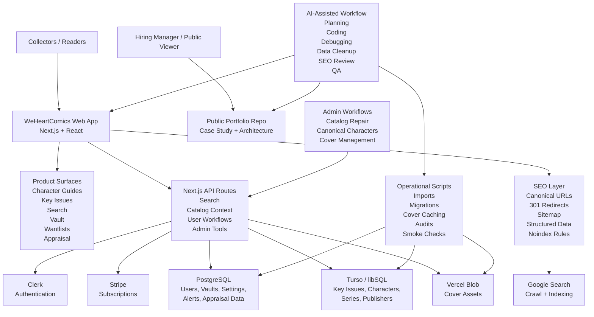

# Architecture Diagram

## What This Shows

WeHeartComics is structured as a production web application, not a static demo.

The main app runs on Next.js and connects to authentication, billing, app data, catalog data, and asset storage. Operational scripts and admin workflows support the messy parts of comic data maintenance: imports, cover caching, canonical character cleanup, audits, and smoke tests.

The SEO layer is intentional. Character guide pages are treated as canonical collector resources, while thin or duplicate routes are redirected or excluded from the sitemap.

AI tools supported the build across planning, engineering, debugging, content modeling, data cleanup, SEO, and QA.
